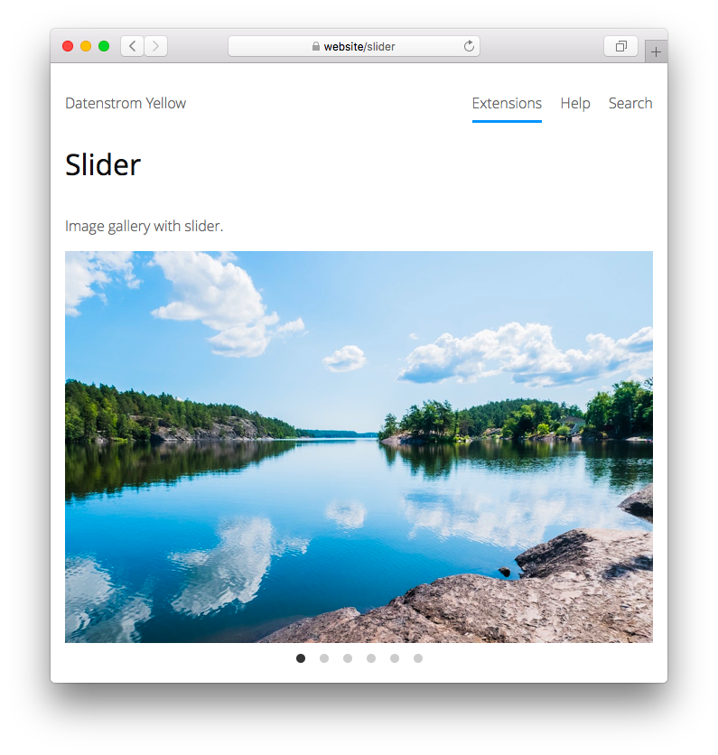

<a href="README-de.md">Deutsch</a> &nbsp; <a href="README.md">English</a> &nbsp; <a href="README-sv.md">Svenska</a>

# Slider 0.9.2

Image gallery with slider.

## How to install an extension

[Download ZIP file](https://github.com/annaesvensson/yellow-slider/archive/refs/heads/main.zip) and copy it into your `system/extensions` folder. [Learn more about extensions](https://github.com/annaesvensson/yellow-update).

## How to add an image gallery

Create a `[slider]` shortcut.

The following arguments are available, all but the first argument are optional:

`Pattern` = file name as regular expression  
`Sorting` = gallery sorting, e.g. `name`, `modified`, `size`  
`Style` = gallery style, e.g. `loop`, `fade`, `slide`  
`Size` = image size, pixel or percent  
`Autoplay` = play images automatically, delay time in milliseconds  

The image formats GIF, JPEG, PNG and SVG are supported. All media files are located in the `media` folder. The `media/images` folder is the place to store your images. The `media/thumbnails` folder contains image thumbnails. You can also create additional folders and organise files as you like.

## How to show image captions

Image captions can be configured in the language settings. Open file `system/extensions/yellow-language.ini` and add a new line for each image. A line consists of file name and description. The image caption is displayed when you hover over an image or use a screen reader.

## Examples

Content file with image gallery:

    ---
    Title: Example page
    ---
    This is an example page with image gallery.

    [slider photo.*jpg]

Adding an image gallery, different sortings:

    [slider photo.*jpg name]
    [slider photo.*jpg modified]
    [slider photo.*jpg size]

Adding an image gallery, different sizes:

    [slider photo.*jpg name loop 25%]
    [slider photo.*jpg name loop 50%]
    [slider photo.*jpg name loop 100%]

Adding an image gallery from a subfolder, different sizes:

    [slider photo-album/ name loop 25%]
    [slider photo-album/ name loop 50%]
    [slider photo-album/ name loop 100%]

Adding an image gallery, play with different delays:

    [slider photo.*jpg name loop 100% 1000]
    [slider photo.*jpg name loop 100% 2000]
    [slider photo.*jpg name loop 100% 5000]

Configuring image captions in the language settings:

    Language: en
    media/images/photo.jpg: This is an example image
    media/images/photo-2387365-fika-time.jpg: Fika is an important part of life in Sweden. Photo: Taylor Franz
    media/images/photo-2493837-lake-and-forest.jpg: Lake and forest in the summer. Photo: Anatoliy Gromov
    media/images/photo-album/screenshot-2020-01.png: A small website by Adam Engel from Sweden.

Selecting file names with a regular expression:

`photo.*jpg` = image files starting with "photo" followed by whatever and "jpg"  
`photo.*jpeg` = image files starting with "photo" followed by whatever and "jpeg"  
`photo-album/` = image files from subfolder "photo-album" followed by whatever  
`photo-album` = image files starting with "photo-album" followed by whatever  
`.*` = all image files  

## Settings

The following settings can be configured in file `system/extensions/yellow-system.ini`:

`SliderSorting` = gallery sorting, e.g. `name`, `modified`, `size`  
`SliderStyle` = gallery style, e.g. `loop`, `fade`, `slide`  
`SliderAutoplay` = play images automatically, delay time in milliseconds  

## Acknowledgements

This extension includes [Splide 2.4.21](https://github.com/Splidejs/splide) by Naotoshi Fujita. Thank you for the good work.

## Developer

Anna Svensson. [Get help](https://datenstrom.se/yellow/help/).
